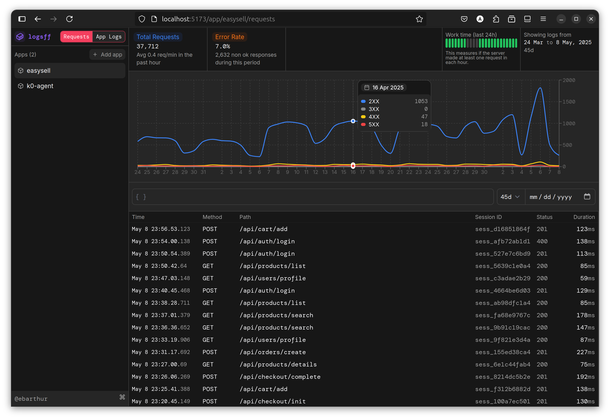

# logsff

<p align="center"></p>

This is a simple to use, simple to deploy observability for backend applications. You can simply deploy this application with vercel.

[](https://vercel.com/new/clone?repository-url=https%3A%2F%2Fgithub.com%2Fblackmann%2Flogsff&env=COOKIE_SECRET&integration-ids=oac_3sK3gnG06emjIEVL09jjntDD)

## Development

Project uses `yarn`. Run `yarn install` afer cloning the project. You'll need a postgres database either locally installed or from some online provider.

## Env variables

The env variables required are:

```sh
DATABASE_URL="postgresql://postgres@127.0.0.1:5432/logsff?schema=public"
COOKIE_SECRET=secret1,secret2
APP_TOKEN=somerandomtoken
```

For a live version of your app, you can use [Neon](https://neon.tech) database.

## Usage

To record a log, make a POST request to `/logs` with the following format:

```ts
type Log = {
  type: "request",
  appId: string,
  method: string,
  path: string,
  status: number,
  timestamp: number,
  duration: number,
  sessionId?: string,
  meta?: Record<string, any>,
} | {
  type: "app"
  appId: string,
  level: "info" | "error" | "warn",
  message: string,
  timestamp: number,
  meta?: Record<string, any>,
}

```

`appId` is the slug of the app. This can be set when creating an app from the dashboard.

`sessionId` is an optional field that can be used to group logs by a session. This is useful for logging requests that are part of a single user session.

`meta` is an optional field that can be used to add any additional data to the log.

## Client

There's a ready-to-use client implemented at [/logsff-client.ts](/logsff-client.ts) that you can copy and paste into your Typescript project. However, you can implement your own client in any language or format you want. You can use the `logsff-client.ts` as a reference implementation.

```ts
import { send } from "./logsff-client";

send({
  type: "request",
  appId: "my-app",
  method: "GET",
  path: "/",
  status: 200,
  timestamp: Date.now(),
  duration: 100,
});
```
